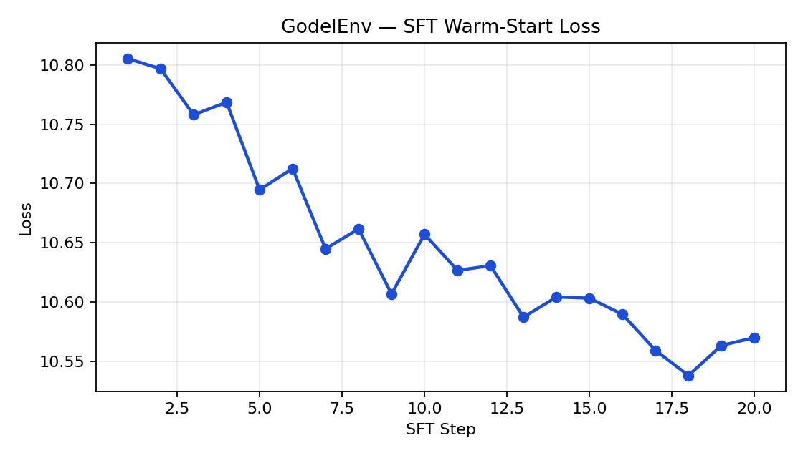
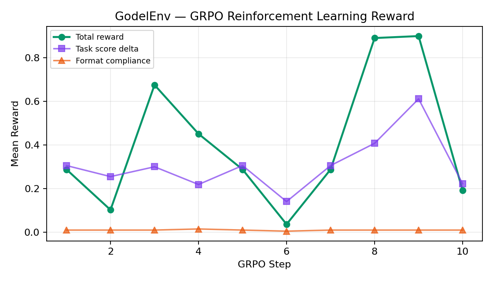
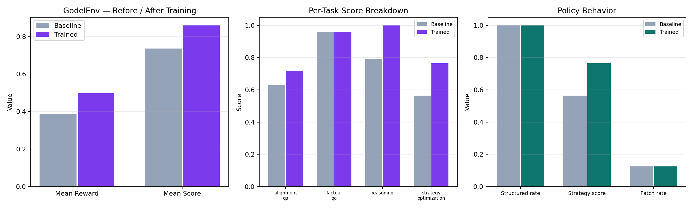

# GodelEnv

GodelEnv is an OpenEnv environment for recursive self-improvement. The agent is not limited to rewriting a single answer; on `strategy_optimization` episodes it can propose a `StrategyPatch`, test that patch on hidden downstream tasks, and keep it only if it improves multi-objective utility without broad regressions.

This repo now behaves like a real environment instead of a demo that only talks about self-improvement:

- OpenEnv-compliant server and client surfaces
- held-out downstream evaluation for strategy mutations
- multi-channel reward with anti-hacking guards
- hybrid LLM-first runtime with deterministic fallback
- reproducible local training evidence with a runnable notebook and saved plots

## Links

- Hugging Face Space: [litterarum/GodelEnv](https://huggingface.co/spaces/litterarum/GodelEnv)
- Source repo: [dwan-ith/GodelEnv](https://github.com/dwan-ith/GodelEnv)
- Training notebook: [train_colab.ipynb](train_colab.ipynb)
- Training script: [train.py](train.py)
- Writeup: [blog_draft.md](blog_draft.md)
- Training evidence: [artifacts/training_run](artifacts/training_run)

## Hackathon Checklist

- OpenEnv dependency updated to `openenv-core>=0.2.3`
- OpenEnv manifest: [openenv.yaml](openenv.yaml)
- Hosted environment link in README: [HF Space](https://huggingface.co/spaces/litterarum/GodelEnv)
- Runnable training script: [train.py](train.py)
- Runnable notebook: [train_colab.ipynb](train_colab.ipynb)
- Committed evidence plots: [loss_curve.png](artifacts/training_run/loss_curve.png), [reward_curve.png](artifacts/training_run/reward_curve.png), [before_after.png](artifacts/training_run/before_after.png)
- Storytelling asset: [blog_draft.md](blog_draft.md)

## Problem

The hackathon theme is self-improvement: build an environment where an agent can create or refine the conditions for its own capability growth.

GodelEnv targets that directly. Most LLM environments reward only the final answer on a fixed task. GodelEnv also lets the agent improve the policy that produces answers:

1. The agent sees the task, current draft, current reasoning strategy, recent failures, downstream family scores, and remaining budget.
2. It can either submit a direct answer edit or propose a `StrategyPatch`.
3. A proposed patch is evaluated against the parent strategy on hidden downstream cases.
4. The Governor accepts the patch only if it improves utility while clearing regression and anti-hacking checks.

That makes the environment a practical recursive-skill-amplification loop rather than a single-turn rewrite benchmark.

## Environment Design

The canonical OpenEnv surface lives in:

- [godel_engine/openenv_environment.py](godel_engine/openenv_environment.py)
- [godel_engine/openenv_models.py](godel_engine/openenv_models.py)
- [server/app.py](server/app.py)
- [godel_engine/client.py](godel_engine/client.py)

Server endpoints:

- `POST /reset`
- `POST /step`
- `GET /state`
- `GET /metadata`
- `GET /schema`
- `GET /health`
- `WS /ws`

### Observation

Each episode exposes:

- `task_prompt`
- `current_solution`
- `current_strategy`
- `recent_failures`
- `downstream_scores`
- rubric scores and feedback
- strategy lineage metadata such as ELO and generation
- step counter and remaining budget

### Actions

The agent can:

1. Submit a direct solution edit.
2. Submit a `StrategyPatch` with `improved_strategy`, `diff_description`, `hypothesis`, and `target_weaknesses`.

### Termination

Episodes end when:

- a patch is accepted
- the trajectory plateaus
- a severe guard violation fires
- the max step budget is reached

## Reward And Guardrails

The reward is multi-channel, not a single scalar:

- `task_score_delta`
- `format_compliance`
- `step_cost`
- `anti_hack_penalty`
- `process_reward`
- `patch_quality`
- `generalization_score`
- `robustness_score`
- `stability_score`

The environment also includes anti-reward-hacking checks:

- empty / repetition / length guards
- forbidden code pattern checks
- regression and canary checks
- strategy variance penalties
- strategy length limits
- guarded patch acceptance rather than unconditional mutation

## Hybrid Runtime

The environment is designed for two useful operating modes:

- `auto`: LLM-first behavior for grading, agent actions, and strategy evaluation, with deterministic fallback if the provider fails
- `deterministic`: reproducible offline mode for training evidence and judging

Supported provider groups:

```bash
set OPENAI_API_KEY=...
set OPENAI_MODEL_NAME=gpt-4o-mini
```

```bash
set API_KEY=...
set API_BASE_URL=https://your-openai-compatible-provider/v1
set CUSTOM_MODEL_NAME=Qwen/Qwen2.5-7B-Instruct
```

```bash
set HF_TOKEN=...
set HF_MODEL_NAME=Qwen/Qwen2.5-7B-Instruct
set HF_API_BASE_URL=https://router.huggingface.co/v1
```

Common runtime flags:

```bash
set GODEL_GRADING_MODE=auto
set GODEL_STRATEGY_EVAL_MODE=auto
set GODEL_PROVIDER_ORDER=openai,custom,huggingface
```

The runtime now uses provider-specific fallback and circuit breaking, so one bad endpoint no longer disables the whole hybrid path.

To verify that a live provider is actually being used instead of silently falling back:

```bash
python hybrid_smoke.py --require-llm
```

For dashboard debugging, the demo server also exposes:

```text
GET /demo/provider-status
```

## Training Pipeline

The repo ships a small but real proof-of-concept training path:

1. Collect prompts from the live environment.
2. Build heuristic warm-start traces.
3. Train a tiny local GPT-2 policy with SFT.
4. Refine it with GRPO against the environment.
5. Save loss, reward, and before/after plots plus a metrics JSON file.

To make the CPU proof-of-concept trainable, the tiny local model emits compact action tokens such as "direct best" or "balanced patch". The environment expands those tokens into full environment actions before verification. This keeps the local notebook runnable while preserving the actual environment semantics.

Run the full pipeline:

```bash
python train.py
```

Quick smoke test:

```bash
python train.py --dry-run
```

Notebook version:

```bash
train_colab.ipynb
```

The notebook defaults to deterministic grading and strategy evaluation so judges can reproduce the committed evidence without API access.

## Training Evidence

The latest committed run compares a random compact baseline against the trained compact policy on 16 prompts across:

- `factual_qa`
- `alignment_qa`
- `reasoning`
- `strategy_optimization`

Headline metrics from [artifacts/training_run/metrics.json](artifacts/training_run/metrics.json):

| Metric | Baseline | Trained | Delta |
| --- | ---: | ---: | ---: |
| Mean reward | 0.4090 | 0.5224 | +0.1134 |
| Mean score | 0.7361 | 0.8384 | +0.1023 |
| Structured action rate | 1.0000 | 1.0000 | +0.0000 |
| Strategy patch rate | 0.1250 | 0.0000 | -0.1250 |
| Patch acceptance rate | 0.5000 | 0.0000 | -0.5000 |

Per-task score means:

| Task family | Baseline | Trained | Delta |
| --- | ---: | ---: | ---: |
| `factual_qa` | 0.9581 | 0.9581 | +0.0000 |
| `alignment_qa` | 0.6319 | 0.7178 | +0.0859 |
| `reasoning` | 0.7917 | 1.0000 | +0.2083 |
| `strategy_optimization` | 0.5628 | 0.6778 | +0.1150 |

Interpretation:

- The local proof-of-concept now shows real learning on both reward and downstream score.
- The trained tiny model converges to the stronger direct-answer action instead of continuing to explore the higher-variance patch action.
- The recursive patch path is still real and verified in-environment, but the tiny CPU policy is conservative. Richer recursive behavior is the next step for the hybrid API-backed path.

### Loss Curve



### Reward Curve



### Before / After Summary



## Dashboard

The dashboard surfaces the live recursive loop:

- score, delta, and step status cards
- strategy ELO, generation, and budget
- current reasoning strategy
- recent downstream failures
- grading / rubric breakdowns
- live log stream for grading source and Governor decisions

## Local Validation

Checks run on the upgraded repo:

```bash
pytest -q
openenv validate
python -m compileall godel_engine server train.py train_colab.py demo.py
```

Notebook execution check:

```bash
python -m jupyter nbconvert --execute --to notebook --inplace train_colab.ipynb
```

## Current Limitations

- The tiny local model is a proof-of-concept, not the final ceiling of the environment.
- The committed CPU run improves reward and score, but it does not yet learn to prefer recursive patches.
- Stronger recursive self-improvement behavior will likely require the hybrid LLM path or a larger local model.

That limitation is honest, and it is exactly why the environment was refactored this way: the environment mechanics are now real, the verifier path is real, the notebook is runnable, and stronger models can plug into the same loop without rewriting the environment.
